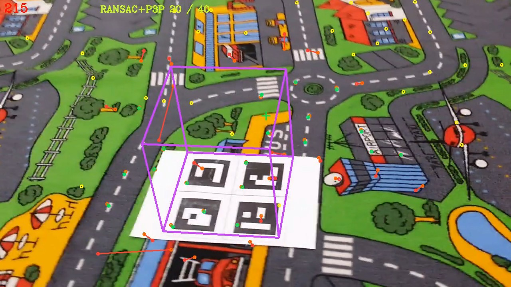
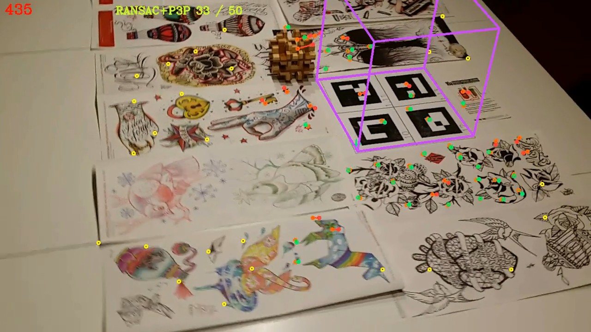

# Visual Odometry Pipeline for Augmented Reality

*Krzysztof Lis, 2017*

[Full description (PDF)](./VisualOdometryPipelineForAR.pdf)

The goal of our program is to track the camera’s pose using visual odometry methods and
display a virtual object in a stable position in the real world. Our intention is to integrate
this method into the open source [Augmented Unreality plugin](https://github.com/adynathos/AugmentedUnreality) and make it available for AR
application developers. This use case is associated with the following requirements:

- Proper scale and orientation is needed to show the virtual object in the correct place.
- There are no constraints on the camera pose.
- The algorithm must run on-line and in real time.

### Example output videos

[](./example_outputs/example_1_table.mkv)

[](./example_outputs/example_2_carpet.mkv)

### Building

Install OpenCV 3.2+ and execute:
```
mkdir build
cd build
cmake ..
make -j4
```

Then run with:
```
./build/aur_odometry table.xml
```
or
```
./build/aur_odometry default.xml
```